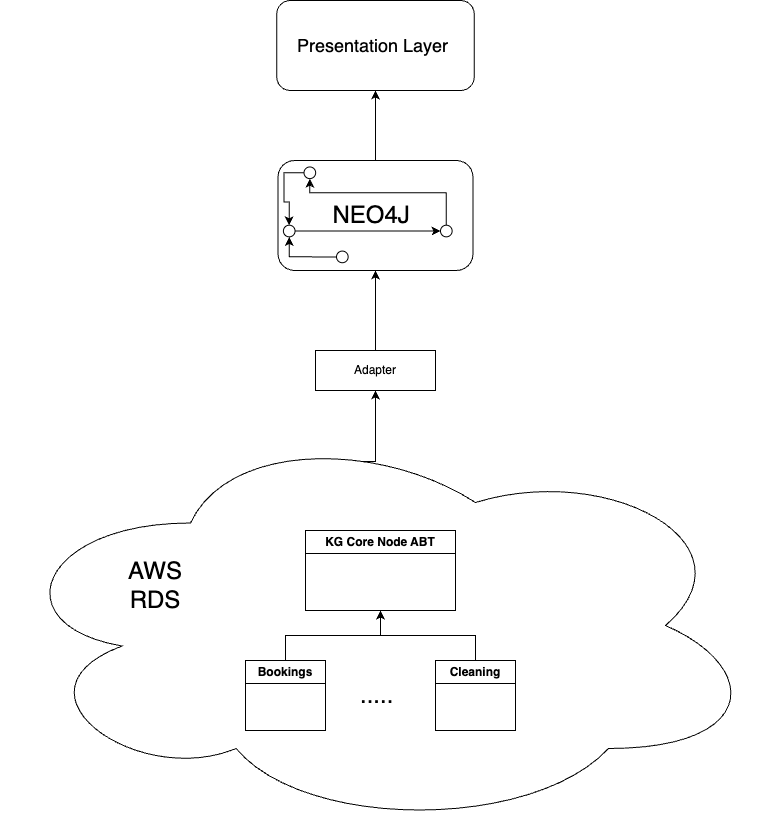

# Knowledge Graphs for the win! 

```
                                   /\
                              /\  //\\
                       /\    //\\///\\\        /\
                      //\\  ///\////\\\\  /\  //\\
         /\          /  ^ \/^ ^/^  ^  ^ \/^ \/  ^ \
        / ^\    /\  / ^   /  ^/ ^ ^ ^   ^\ ^/  ^^  \
       /^   \  / ^\/ ^ ^   ^ / ^  ^    ^  \/ ^   ^  \       *
      /  ^ ^ \/^  ^\ ^ ^ ^   ^  ^   ^   ____  ^   ^  \     /|\
     / ^ ^  ^ \ ^  _\___________________|  |_____^ ^  \   /||o\
    / ^^  ^ ^ ^\  /______________________________\ ^ ^ \ /|o|||\
   /  ^  ^^ ^ ^  /________________________________\  ^  /|||||o|\
  /^ ^  ^ ^^  ^    ||___|___||||||||||||___|__|||      /||o||||||\
 / ^   ^   ^    ^  ||___|___||||||||||||___|__|||          | |
/ ^ ^ ^  ^  ^  ^   ||||||||||||||||||||||||||||||oooooooooo| |ooooooo
ooooooooooooooooooooooooooooooooooooooooooooooooooooooooooooooooooooo
```

### 1. Scenario
Short-Term Renting business is hard, but without the right monitoring tools for customer satisfaction, it is even harder(then it has to be).
This Repo utilizes modern Knowledge-Graph Approaches to assist hotels and short-term rental businesses in identifying problems regarding their cleaning services. 
In particular, it is aiming at identifying if certain appartements or cleaning personals form clusters of exceptionally good or bad customer experiences.
Hence the thereby modeled KG should provided the user with a good structure for all general queries. 

#### Presentation Layer
For this reason, this repo provides a presentation layer that displays the following information in streamlit apps: 
- Cleaning personal with best/worst customer experiences.
- Apartments that are linked to the best/worst customer experiences.
- If certain clusters of apartments, cleaning personals or books exist with good or bad customer experiences exist.

and in addition, a graph query console will maybe be integrated  

### Architecture
This application utilizes data that has been fetched from KROSS Booking and TimeTac via their internal APIs and that is currently stored in a AWS RDS in multiple tables using the architecture displayed below: 



In order to create KGs, initially an (RDB) ABT according to the following Object Model has been created using `SQL` and is then parsed and inserted into a Neo4J Graph Database that runs inside a docker container: 


